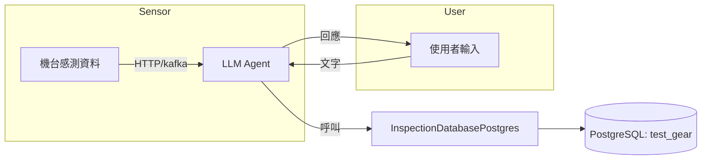

# 專案規劃：LLM Agent 與檢驗資料管理系統

## 1. 專案目標
- 建置一套 LLM Agent，能夠同時處理：
  1. 機台連續上傳感測資料，並使用 `InspectionDatabasePostgres` 工具儲存檢驗記錄。
  2. 使用者透過文字訊息提交檢驗任務，系統解析欄位後，呼叫 `InspectionDatabasePostgres` 儲存。
  3. 若使用者輸入中缺少必要欄位，回應缺少哪些欄位並提供補正方式。
- 資料庫名稱規劃為：`test_gear.db`（本地 SQLite 測試）或 PostgreSQL 資料庫 `test_gear`（正式環境）。

## 2. 環境與依賴
1. Python 3.10+
2. 安裝套件：
   ```bash
   pip install psycopg2-binary transformers ollama-python fastapi uvicorn
   ```
3. LLM API：Ollama 客戶端或其他模型服務。

## 3. 架構設計


## 4. 核心模組

### 4.1 InspectionDatabasePostgres 工具
- 已實作：連線、建表、增查刪功能。
- 參數：DSN（`dbname=test_gear user=... password=... host=... port=...`）。

### 4.2 欄位檢查模組
- `required_fields = ['inspector','inspection_date','inspection_order_number','work_number','workstation_number','part_number','part_name','specification','measurement_data']`
- 利用正則或 LLM 將文字解析成字典，檢查欄位缺失。

### 4.3 LLM 解析與交互
- 使用 `ollama.Client` 或其他 API。
- 將使用者文本轉換為欄位值。

### 4.4 Agent 核心
- 同步/異步接收感測與使用者訊息。
- 結合欄位檢查與 DB 工具，回應結果。

## 5. 開發步驟
1. **建立資料庫**
   - 本地：產生 `test_gear.db`，測試 SQLite 版本 (`InspectionDatabase`)。
   - 正式：在 PostgreSQL 建立資料庫 `test_gear`。
2. **實作欄位檢查**：解析文字、比對欄位、生成缺失清單。
3. **整合 LLM 客戶端**：包裝 `OllamaClient`，測試聊天與解析效果。
4. **開發 Agent 服務**：採用 FastAPI 建立 HTTP 接口：
   - 感測資料上傳 endpoint
   - 使用者任務提交 endpoint
5. **串接工具**：在 endpoint 處理流程中呼叫檢查與 DB 插入。
6. **測試與驗證**：撰寫單元測試，模擬感測與文字任務。
7. **部署與監控**：容器化或伺服器部署，設置日誌與告警。

## 6. 時程規劃
| 里程碑        | 週次 | 工作內容                                     |
|---------------|------|----------------------------------------------|
| 需求與規劃    | 1    | 完成專案規劃與環境建置                       |
| 工具開發      | 2-3  | 實作 DB 工具與欄位檢查模組                   |
| Agent 開發    | 4-5  | LLM 整合與 FastAPI 服務實作                 |
| 測試與完善    | 6    | 撰寫測試、修正 bug                          |
| 部署與維運    | 7    | 容器化、CI/CD、監控                         |

---

**存檔路徑**：`/data/SQL_demo/planning.md`  
**更新日期**：2025-05-28
